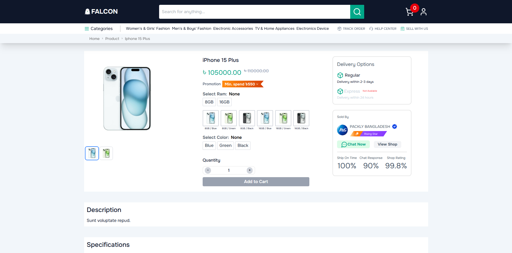
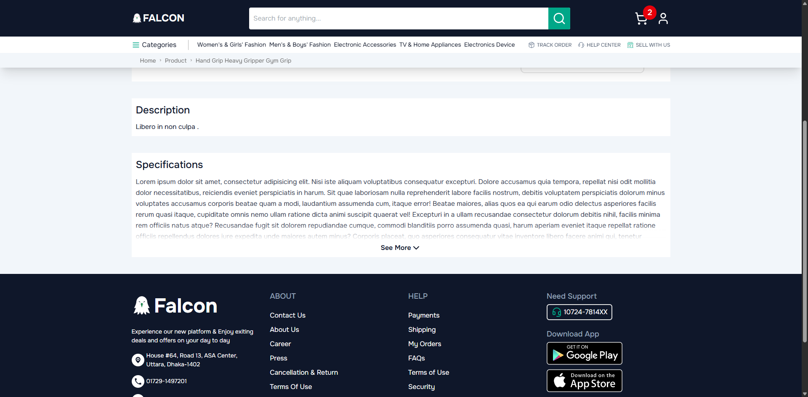
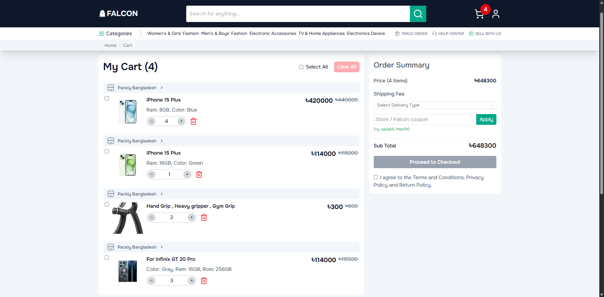

# 🛍️ E-Commerce Product & Cart Module

This project is part of a frontend e-commerce application, built with **React**, **React Router**, **TailwindCSS**, **ShadCN**, and **Axios**. It includes dynamic product detail rendering and cart functionality, integrating quantity control, delivery fee logic, coupon application, and a checkout summary flow.

## 🚀 Live Website

🔗 [Visit the Live Site](https://falcon-steadfast-adnan.vercel.app/)

> ⚠️ **Note on API Connectivity:**  
> This project is hosted over HTTPS, but the provided backend APIs currently use HTTP. Modern browsers block HTTP requests from secure (HTTPS) pages due to security policies.
>
> As a result, certain data-fetching features may not work in the live deployment. The app is designed to function as expected once secure API endpoints (HTTPS) are available.
>
> API endpoint URLs are defined in [`/src/lib/constants.js`](./src/lib/constants.js) for easy modification if the reviewer wants to point to alternative or secure services.

## 🧰 Technologies Used

- **React**
- **React Router DOM**
- **TailwindCSS**
- **ShadCN UI**
- **Axios**
- **Redux Toolkit**
- **Vite**

## 📦 Features

- Product details page with dynamic variant pricing and stock detection
- Responsive cart functionality with:
  - Quantity adjustment with stock limits
  - Select-all / remove selected interactions
  - Dynamic price updates
- Delivery type selection (Inside Dhaka, Outside Dhaka, Express)
- Delivery fee calculation based on selection
- Coupon application logic with sample codes (`save50`, `free100`)
- Subtotal computation: `cartTotal + deliveryFee − couponDiscount`
- Terms & Conditions checkbox gating checkout button
- Styled components via TailwindCSS and ShadCN
- Optimized for mobile and desktop views

## 📸 Screenshots

### Product Details



### Description and Specifications



### Cart



## 📝 Usage

Clone the repo and install dependencies:

```bash
git clone https://github.com/adnan059/Falcon_SteadFast.git
cd Falcon_SteadFast
npm install --legacy-peer-deps
npm run dev

```
